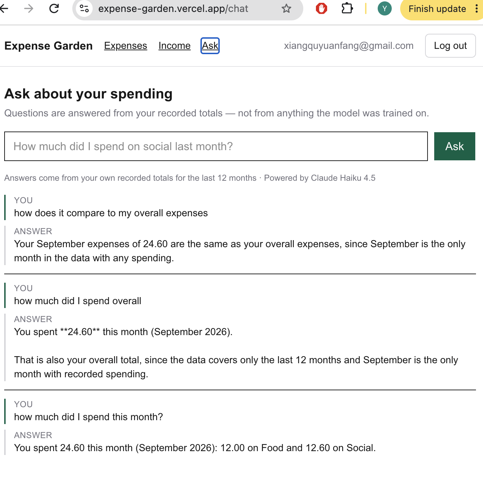

# Expense Garden

An expense tracker where **you type what you spent in plain English** and an LLM turns it
into a structured expense; and where **you ask questions about your own spending** and get
answers grounded in your real rows, read under Row Level Security.

- `spent 12 on coffee` → `{ amount: 12.00, category: food, description: "coffee", date: today }`
- `how much did I spend on social last month?` → an answer computed from *your* totals, with
  the figures it used shown in the reply.

Sprint 3 project (Turing College, BAI.3.08). Built on the Sprint 2 security work: Supabase
auth, RLS on every user table, no `service_role` key anywhere in the project.

**Live URL:** <https://expense-garden.vercel.app>

**Screenshot:**



> **Where the deployed code lives.** Vercel's GitHub App has to be approved on a repository
> owned by the account connecting it, so the live deployment is built from a personal repo,
> `expense-garden`. This submission repo holds the same code — the two are not different
> versions of the app.

---

## Why the AI is the core, not a decoration

Every expense tracker ever built already lets you fill in a form. That is precisely why
nobody keeps using them. The friction was never storage — it is the twelve seconds of
classification work per transaction: pick a category, pick a date, phrase a description. Do
that four times a day and you stop after a week.

So in this app **natural language is the input method, and the form is the fallback.** The
model does the categorising; you type a sentence. Strip the LLM out and what is left is
another form that loses to a spreadsheet.

The same holds for chat. The data needed to answer "am I overspending on social?" is already
sitting in the aggregate views — but answering it today means knowing which view to read,
what a month boundary is, and how to compare two numbers. The AI is what turns a schema into
something you can ask a question.

Both AI paths write to the same tables and read through the same RLS policies as the rest of
the app. The model is never a privileged actor:

- **Parser output is untrusted input.** A schema-valid object can still carry a negative
  amount or an unknown category. The `CHECK` constraints and the `categories` foreign key are
  the enforcement; validation in the server action exists to produce a good error message.
- **Grounding goes through RLS.** Chat reads the `security_invoker` views
  (`v_month_expense_totals`, `v_month_income_totals`, `v_category_month_totals`) as the
  signed-in user. There is no `service_role` key in this project and none is to be added.
- **No `user_id` from the client, ever** — not in a form, not in a server action signature,
  not in a prompt. Identity comes from the session cookie via `supabase.auth.getUser()`.
- **Prompts leave our infrastructure, so they carry only what the answer needs**: aggregate
  figures, never raw transaction rows, never a user id or email address.

Persistence: chat history lives in `public.messages` (one row per turn, append-only,
owner-scoped RLS), so the transcript survives a reload and a new device.

---

## Architecture in one paragraph

Next.js 16 App Router + Supabase. Auth cookies are refreshed in `src/proxy.ts` (Next 16
renamed the `middleware` convention to `proxy`) — that is UX only; the security boundary is
RLS in Postgres. Expense parsing is a Server Function
(`src/app/(app)/expenses/ai-actions.ts`). Chat is a Route Handler
(`src/app/api/chat/route.ts`) because it streams; since a Route Handler does not get Next's
automatic Server-Action protections, it does its own explicit auth check and same-origin
check. Both OpenRouter calls read `OPENROUTER_API_KEY` inside server-only modules. Model
slugs live in one place, `src/lib/ai/models.ts`.

Full design, schema and ranked risks: [`docs/ARCHITECTURE.md`](docs/ARCHITECTURE.md).
OpenRouter reference with source URLs: [`docs/openrouter-reference.md`](docs/openrouter-reference.md).
`ai-code-reviewer` report: [`docs/ai-code-review.md`](docs/ai-code-review.md).

---

## Running locally

Requires Node 20+ and a Supabase project.

```bash
npm install
touch .env.local        # fill it in — see the table below
npx supabase db push    # apply migrations to your Supabase project
npm run dev             # http://localhost:3000
```

Open <http://localhost:3000>, sign up, and confirm the email if your Supabase project has
email confirmation on (the link lands on `/auth/callback`).

### Environment variables

`.env.local` is git-ignored (`.gitignore` has `.env*`) and must never be committed.

| Variable | Public? | Where to find the value |
| --- | --- | --- |
| `NEXT_PUBLIC_SUPABASE_URL` | **Safe to be public.** Read by browser code. | Supabase dashboard → Project Settings → **API** → *Project URL*. Looks like `https://abcdefgh.supabase.co`. |
| `NEXT_PUBLIC_SUPABASE_ANON_KEY` | **Safe to be public.** It is designed to ship to browsers; RLS is what protects the data. | Supabase dashboard → Project Settings → **API** → *Project API keys* → `anon` / `public`. |
| `OPENROUTER_API_KEY` | **Secret. MUST NOT have a `NEXT_PUBLIC_` prefix** and must never be passed to a client component. | <https://openrouter.ai/keys> → *Create key*. Starts `sk-or-v1-…`. For this project it is the school-issued key. |
| `APP_ALLOWED_HOSTS` | **Server-only** (no `NEXT_PUBLIC_`). Optional — see below. | Not a secret; you write the value yourself. |

Minimal `.env.local`:

```dotenv
NEXT_PUBLIC_SUPABASE_URL=https://<your-project-ref>.supabase.co
NEXT_PUBLIC_SUPABASE_ANON_KEY=<anon key>
OPENROUTER_API_KEY=sk-or-v1-<your key>
# APP_ALLOWED_HOSTS=localhost:3000,127.0.0.1:3000   # only if you need it — see below
```

There is deliberately **no service-role key** in this project. If you find yourself wanting
one, see `docs/ARCHITECTURE.md` §D.4 — the answer is a policy, not a key.

### `APP_ALLOWED_HOSTS`

The streaming chat endpoint (`src/app/api/chat/route.ts`) is a Route Handler, so Next's
built-in Server-Action origin check does not cover it and the handler performs its own
same-origin check: it compares the browser's `Origin` header against a list of hosts the app
is willing to be addressed as. A request whose `Origin` is missing, unparseable, or not on
that list gets `403 Cross-origin request refused.`

- **Unset (the default):** the allowed list is `[request.nextUrl.host]` — the host Next
  itself resolved for the request. Not `x-forwarded-host` and not the raw `Host` header read
  directly, because those are caller-supplied.
- **Set:** a comma-separated list of **host[:port] values, no scheme and no path**, which
  *replaces* the default entirely. Comparison is case-insensitive and whitespace is trimmed.

```dotenv
APP_ALLOWED_HOSTS=expense-garden.vercel.app,garden.example.com
```

**When you need it.** Behind a reverse proxy that rewrites the host, `nextUrl.host` is the
internal hostname while the browser's `Origin` is the public one, so *every* chat request
403s. Setting the public host(s) fixes it. The same bites in local dev if you open the app on
`http://127.0.0.1:3000` while Next resolved `localhost:3000`, or vice versa — set both, or
just always use one.

**When not to.** Because setting it *replaces* the default rather than adding to it, an
incomplete list is how you break chat. If you don't have a host-rewriting proxy in front of
the app, leave it unset.

> This variable previously existed only as a comment in the route handler — finding S2 in
> [`docs/ai-code-review.md`](docs/ai-code-review.md). This section is that fix.

---

## Deploying to Vercel

Set these in **Vercel → Project → Settings → Environment Variables**, for the Production
environment (and Preview, if you want previews to work). Values come from the same places as
the table above — nothing is read from the repo.

| Variable | Environments | Notes |
| --- | --- | --- |
| `NEXT_PUBLIC_SUPABASE_URL` | Production, Preview, Development | Public by design. |
| `NEXT_PUBLIC_SUPABASE_ANON_KEY` | Production, Preview, Development | Public by design. |
| `OPENROUTER_API_KEY` | Production, Preview | **Secret.** No `NEXT_PUBLIC_` prefix. Never in the repo. |
| `APP_ALLOWED_HOSTS` | *Usually omit* | On Vercel, `nextUrl.host` is derived from the (Vercel-set) `Host` header, so it already equals the public host the browser used, and the default check works on both production and preview URLs. Set it only if you put a custom proxy in front of Vercel — and then set it in **Production only**, to the public host(s) without scheme, e.g. `expense-garden.vercel.app,garden.example.com`. Setting it in Preview would 403 every per-deployment preview URL, because those hostnames change on every push. |

Two things that are not env vars but will break auth if skipped:

1. **Supabase → Authentication → URL Configuration.** Set *Site URL* to your Vercel
   production URL, and add `https://<your-app>.vercel.app/auth/callback` (plus any custom
   domain) to *Redirect URLs*. Email confirmation links go through `/auth/callback`.
2. **Migrations.** `npx supabase db push` targets your hosted Supabase project; deploying to
   Vercel does not apply them. Migrations 6 and 7 in `supabase/migrations-deferred/` are
   deliberately not pushed — see `CLAUDE.md`.

Verify the deploy the way the brief asks: open the production URL in a **brand-new incognito
window** and confirm you get the sign-in page, not any data — and that hitting
`/dashboard`, `/expenses`, `/income` and `/chat` directly redirects to sign-in rather than
rendering.

---

## Model choice is constrained, not chosen

Both AI features run on **`anthropic/claude-haiku-4.5`**.

For parsing that is the right call on the merits: one small JSON object against a fixed
schema with six known categories, on the highest-volume call in the app, where the user is
waiting to see their expense appear. Sonnet-tier reasoning buys nothing.

For chat it is **not** the model this project would have picked. Chat has to choose which
month to compare, notice that income and expenses move in opposite directions, and not
misread a category total — arithmetic and comparison over supplied numbers is exactly where
a cheaper model produces confidently wrong answers, and a wrong number in a financial app is
worse than a slow one. `anthropic/claude-sonnet-5` was selected on the merits.

**It is unavailable by policy.** The OpenRouter key is school-issued, so it belongs to the
school's workspace and inherits that workspace's guardrail — a **model allowlist**, verified
live on 2026-09-07 by probing six vendors. Every Sonnet and Opus slug returns HTTP 404 with
`model-ignored-by-guardrail` at the routing step, while `claude-haiku-4.5` passes. It is not
a bad slug (all of them are live in `GET /api/v1/models`), not a price cap
(`mistralai/mistral-nemo` at $0.03/M output is blocked while Haiku 4.5 at $5.00/M passes),
and not a provider rule (`gpt-4o-mini` and `gpt-4o` share endpoints; only the first passes).
The allowlist is an institutional cost control, not visible to us and not ours to change.
Full evidence and the dead ends not worth re-investigating are in `CLAUDE.md`.

The mitigation is in the prompt: rule 3 requires chat to **show the figures it used**, so a
wrong sum is visible in the reply rather than hidden inside a confident sentence. Within the
current allowlist, `google/gemini-2.5-flash` and `openai/gpt-5-mini` are the fallbacks if
Haiku's arithmetic proves weak. If the allowlist ever changes, `CHAT_MODEL` in
`src/lib/ai/models.ts` carries a comment on how to switch back — one edit, one file.

---

## Optional tasks completed

Three, each on its own branch and PR.

- **Model display (easy).** Every AI surface names the model actually running it. The
  displayed label and the slug sent to OpenRouter are derived from the same constant in
  `src/lib/ai/models.ts` (`formatModelSlug(CHAT_MODEL)`), so the label cannot drift from the
  model that ran; the raw slug is available on hover. Shown on `/chat`, `/expenses` and the
  dashboard's quick-log panel.
- **Streaming responses (easy).** Chat answers appear word by word as they arrive. This is
  what moved chat from a Server Function to a Route Handler — a Server Function returns a
  value once and cannot emit tokens as they arrive. The stream is newline-delimited JSON
  (`{"t":"delta"}` / `{"t":"done"}` / `{"t":"error"}`) so the client can distinguish text
  from a mid-stream failure rather than rendering an error message as part of the answer. A
  truncated or disconnected answer is not persisted.
- **Deploy to a live Vercel URL (medium).** See the deployment section above; every secret
  lives in the Vercel dashboard only.

---

## Security baseline (carried from Sprint 2)

- RLS enabled with owner-scoped policies on every table holding user data, in the same
  migration as the `create table` — never a migration later.
- Aggregate views are `security_invoker = on`, so they read as the caller and cannot become a
  cross-user leak (`docs/ARCHITECTURE.md` §B.6, §D.2).
- `supabase.auth.getUser()`, never `getSession()`, wherever a decision depends on identity:
  `getSession` decodes the cookie without contacting the auth server, so a forged cookie can
  produce a session-shaped object.
- The two-account RLS test lives in `supabase/tests/rls.sql`.
- No `service_role` key exists in this project, and an LLM feature is not a reason to add one.
